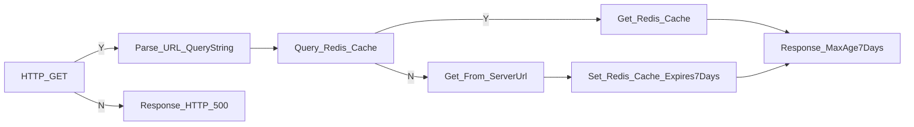

# ReverseProxy_Redis
sample .ashx for Reverse Proxy with Redis
read explanation on [Medium](https://medium.com/@lag945/%E5%9C%A8windows%E6%95%B4%E5%90%88redis%E8%88%87asp-net-reverse-proxy-a846170b0353)

## flow chart

## parameter
- serverUrl - 代理目標，預設"http://127.0.0.1"
- redisUrl - redis伺服器，預設"localhost:6379"
- pageName - 網頁名稱，有改名要對應修改
- starACAOl - 是否允取跨域，預設允許
- maxAgeDays - 最大快取天數，預設7天
- redisExpiryDays - redis快取過期天數，預設7天
